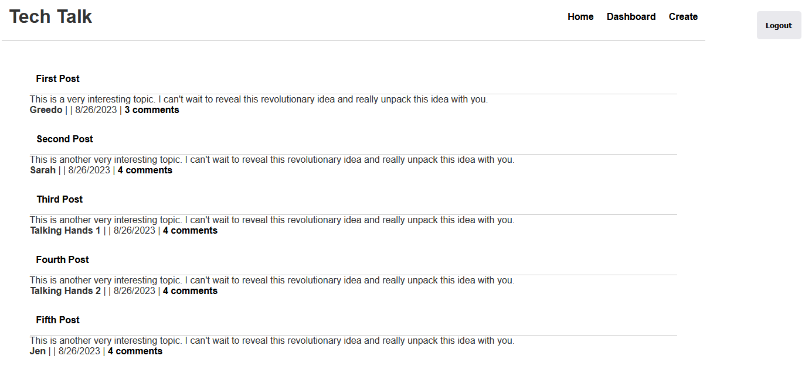

  # Tech Blog

  ## Description

  This is a blogging website called Tech Talk. From here, you can create a post, view your posts from the Dashboard, or view all posts from the Homepage.
  
  From the Dashboard, you may edit or delete your posts.
  
  You may also leave a comment from the dashboard or homepage.

  The technologies used include bcrypt, sequelize and its session store, dotenv, express, handlebars, and mysql2.
  
  The challenge that I faced during this project involved several errors, but one was caused by casing: I originally had "class comment extends model," but it needed to be: "class Comment extends Model."
    
  Future development would include the option to edit your posts from the homepage and after clicking Save, the text box should clear.

  ## Mock

  
      
  ## Links

  Repo: https://github.com/Coridane/techblog
  Website: https://coridane.github.io/techblog/
